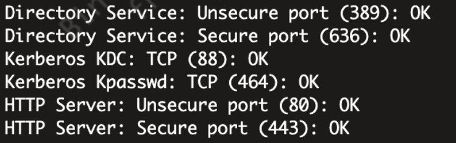
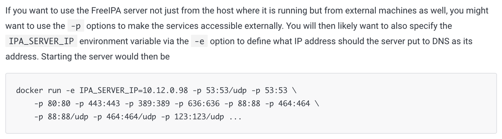
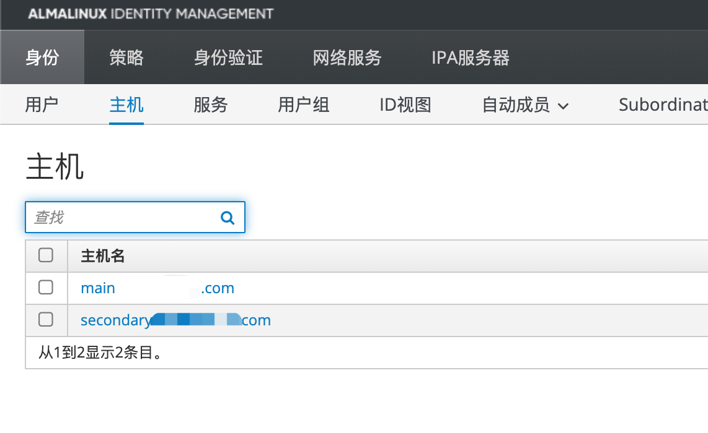
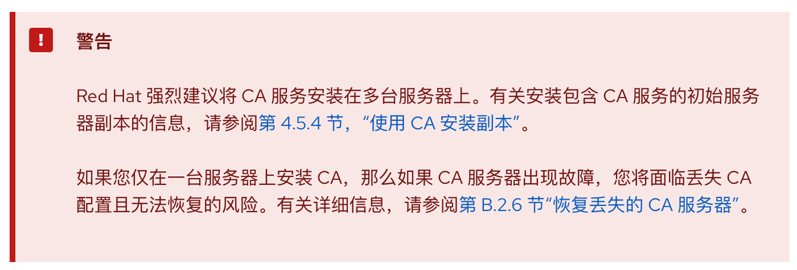

## 部署主节点
部署FreeIPA需要支持cgroupv2的系统，例如ubuntu22.04或者Fedora

以及需要使用podman而不是docker

运行下面的命令来建立主节点
```shell
podman run --name freeipa -ti \
    -h main.example.com \
    --read-only \
    -v /var/lib/ipa-data:/data:Z \
    --sysctl net.ipv6.conf.all.disable_ipv6=0 \
    -p 80:80 -p 443:443 -p 389:389 -p 636:636 -p 88:88 -p 464:464 \
    -p 88:88/udp -p 464:464/udp -p 123:123/udp \
    freeipa/freeipa-server:almalinux-9
```
命令说明：
- `-h` 要新建的服务器的域名，注意main往后的域名以后都无法修改了，如果修改的话，在gitlab登录会开一个新用户，因为gitlab识别同一个用户的原理是识别其DN，例如`DN: uid=example.user,cn=users,cn=accounts,dc=example,dc=com`，如果修改域名的话，dc会变化。同理可得如果DN一致，无论如何折腾都会识别为同一用户
- `--read-only` 官方命令是打开的，不知道关掉的后果
- `-v` 挂载数据，只需要挂载`/data`这一个目录
- `--sysctl net.ipv6.conf.all.disable_ipv6=0` 开ipv6，不开会报错
- `-p ...` 开了很多端口，常用的只有80、443、389，别的端口用途见图，还开了不知道做啥的123，官方也没说。此外把53给删掉了，因为提示端口占用。






需要注意的是，podman无守护进程，所以不能在启动参数里加个`--restart=always`来做到开机自启，解决方法是自己写个守护进程，然后启动命令写上`podman start --filter restart-policy=always --all`

## 部署从节点（replica）
部署从节点意味着各个节点之间需要通信，因此推荐先在主节点和从节点的服务器上写hosts以避免域名解析之类的问题（如果你有这个域名，且正确设置了DNS解析，那就可以不用添加hosts）
```text
192.168.69.1 main.example.com
192.168.69.2 secondary.example.com
```
然后就简单了，直接在从服务器运行容器的replica模式就行，记得改-h
```shell
podman run --name freeipa -ti \
    -h secondary.example.com \
    --read-only \
    -v /var/lib/ipa-data:/data:Z \
    --sysctl net.ipv6.conf.all.disable_ipv6=0 \
    -p 80:80 -p 443:443 -p 389:389 -p 636:636 -p 88:88 -p 464:464 \
    -p 88:88/udp -p 464:464/udp -p 123:123/udp \
    freeipa/freeipa-server:almalinux-9 ipa-replica-install --no-ntp \
    --principal admin --admin-password 'astrongpassword' \
    --server main.example.com \
    --domain example.com \
    --setup-ca
```
警告：如果replica安装失败，重试之前要去主服务器的面板里删掉从服务器的host，并且重启主服务器的容器以清除缓存！不然无法再次安装replica！提示认证错误！



一些参数说明:
- `--no-ntp` 不使用主服务器的ntp服务，没这个选项会报错说找不到ntp服务
- `--principal admin --admin-password 'astrongpassword'` 主服务器的web账号和密码，脚本需要登录主服务器去授权建立副本
- `--server main.example.com` 主服务器的地址
- `--domain example.com` 域名，把地址最前面一级去掉就行
- `--setup-ca` 安装CA副本，官网强烈要求加上这个，不然主服务器炸了会丢失CA



### 额外说明

主服务器和从服务器之间是同步的，无论在哪个服务器上面修改，都会同步到对方的服务器

如果主服务器炸了，比如不小心删了虚拟机。那么直接把gitlab的ldap认证地址填到从服务器的地址就行，或者干脆在gitlab设置多个LDAP登录入口，分别对应主服务器和从服务器