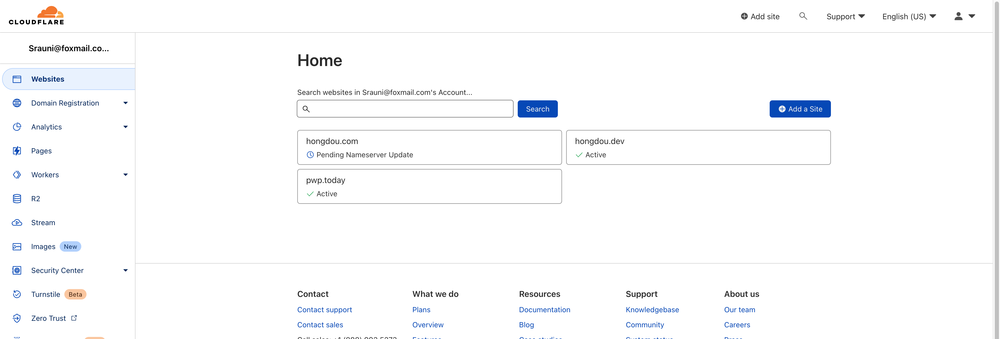
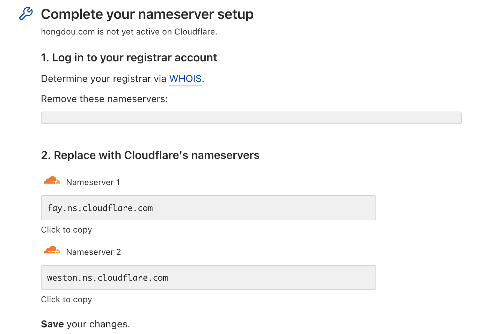
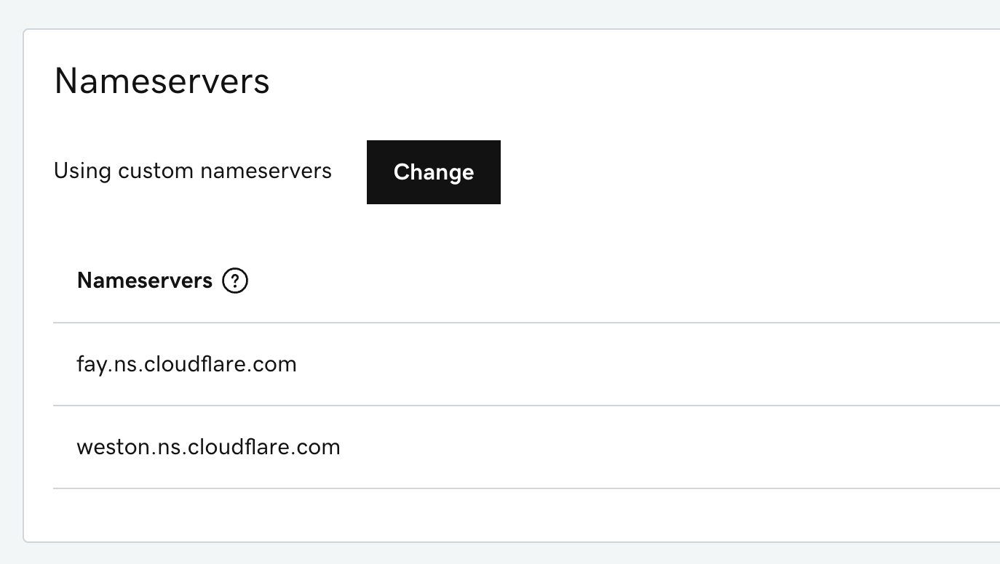
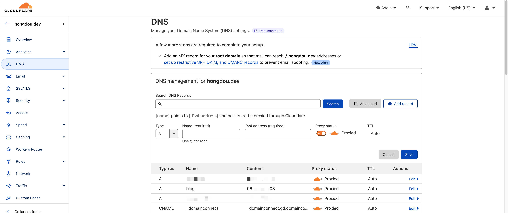
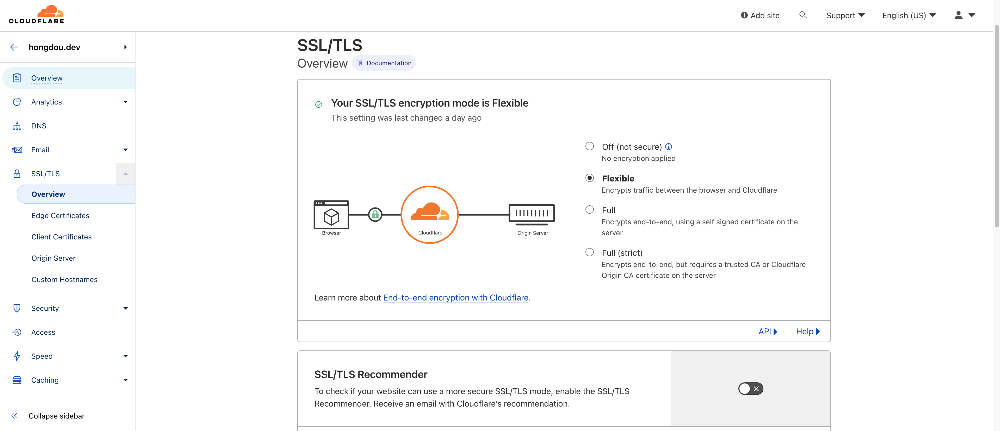

## 本文章使用的部署环境
操作系统：ubuntu 22.04

## hugo的准备
本文章默认使用podman部署，他和docker的使用区别仅仅在于命令里把`docker`换成`podman`。

新建一个文件夹用来存放博客所有的内容
```sh
mkdir -p my_blog/themes
```

然后需要进去下载一个主题，并且使用这个主题提供的站点模板
```sh
cd my_blog/themes
git clone https://github.com/CaiJimmy/hugo-theme-stack.git
```

将站点模板拷贝到my_blog下面
```sh
cp -r hugo-theme-stack/exampleSite/* ../../my_blog/
```

这个时候站点就搭好了，我们要想办法将hugo启动起来

安装podman
```sh
apt install podman
```

然后输入下面的命令启动hugo服务器
```sh
podman run -it --name hugo -v $(pwd)/my_blog:/src -p 1313:1313 docker.io/klakegg/hugo:ext-ubuntu server
```
正常启动的话应该能看到这样的信息
```
Start building sites … 
hugo v0.105.0-0e3b42b4a9bdeb4d866210819fc6ddcf51582ffa+extended linux/amd64 BuildDate=2022-10-28T12:29:05Z VendorInfo=hugoguru

                   | ZH-CN  
-------------------+--------
  Pages            |    28  
  Paginator pages  |     0  
  Non-page files   |     6  
  Static files     |     0  
  Processed images |    12  
  Aliases          |    10  
  Sitemaps         |     1  
  Cleaned          |     0  

Built in 243 ms
Watching for changes in /src/{assets,content,themes}
Watching for config changes in /src/config.yaml, /src/themes/hugo-theme-stack/config.yaml
Environment: "production"
Serving pages from memory
Running in Fast Render Mode. For full rebuilds on change: hugo server --disableFastRender
Web Server is available at http://localhost:1313/ (bind address 0.0.0.0)
Press Ctrl+C to stop
```

这个时候尝试一下连接hugo是否有反应，能返回个html就说明站点能正常访问了
```
root@hongdou:~# curl http://localhost:1313/
<!DOCTYPE html>
<html lang="zh-cn" dir="ltr">
    <head>
        <meta name="generator" content="Hugo 0.105.0"><script src="/livereload.js?mindelay=10&amp;v=2&amp;port=1313&amp;path=livereload" data-no-instant defer></script><meta charset='utf-8'>
<meta name='viewport' content='width=device-width, initial-scale=1'><meta name='description' content='MtF/
...
```

因为我们经常需要重启hugo，所以写个脚本方便操作

在用户根目录创建个`blog.sh`文件，写入如下内容
```sh
#!/bin/sh
podman stop hugo || true
podman rm hugo || true
podman run -d --name hugo -e HUGO_ENV=production -v $(pwd)/my_blog/:/src -p 1313:1313 docker.io/klakegg/hugo:ext-ubuntu server
```
然后执行`chomd +x blog.sh`给他执行权限

以后只要输入`./blog.sh`就能自动重启了

如果想看执行的log来排错，可以输入`podman logs hugo`

## nginx的准备（可选）
使用nginx可以让你一个80或者443端口转发到多个后端应用

例如我不光搭建了这一个blog，我还搭建了rancher和jumpserver，都走同一台服务器的80端口

如果不使用nginx的话，访问每个应用只能单独输入端口号，不能做到共用80端口

使用nginx很简单，先`apt install nginx`安装，然后新建个名为`hugo`的配置文件（你也可以取个别的名字）
```
vim /etc/nginx/sites-enabled/hugo
```
打入以下内容，注意需要把`server_name`后面的域名改成自己的域名

如果你的hugo后端开放的不是1313端口，就需要在`upstream blog-default`里修改`server`字段
```nginx
upstream blog-default {
  zone blog-default 64k;
  server 127.0.0.1:1313;
  keepalive 2;
}

server {
    listen 80;
    listen [::]:80;
    server_name blog.example.com;

    client_max_body_size 128M;

    location / {
      proxy_http_version 1.1;
      proxy_set_header "Connection" "";

      proxy_set_header Host $host;
      proxy_set_header X-Real-IP $remote_addr;
      proxy_set_header X-Forwarded-For $proxy_add_x_forwarded_for;
      proxy_set_header X-Forwarded-Proto $scheme;

      proxy_pass http://blog-default;
    }
}
```
弄好配置以后输入`systemctl restart nginx`来重启nginx即可生效


## 域名及Cloudflare的准备
使用Cloudflare可以隐藏服务器的真实IP避免遭受攻击，还可以自动配置SSL证书，因此本教程使用Cloudflare来隐藏服务器以及添加SSL加密。

首先需要购买域名以及注册Cloudflare，我们这里假设已经做好了

在Cloudflare添加自己的站点，点击右边的`Add a Site`



接着需要去域名提供商，将域名的Nameservers修改为Cloudflare提供的内容





等待Cloudflare成功验证域名之后，添加DNS记录，并且启用代理



在SSL/TLS里选中`Flexible`，这会仅启用浏览器到Cloudflare之间的加密，默认是选上的



至此，博客已经可以用域名正常访问了！


## 修改博客配置以及发表新文章
### 修改博客配置
现在我们博客还是模板的样子，因此我们需要修改配置，配置文件在`my_blog/config.yaml`，进去以后根据自身情况来修改，我的配置是这样的
```yaml
baseurl: https://blog.hongdou.dev
languageCode: zh-cn
theme: hugo-theme-stack
paginate: 5
title: 红豆豆的猫窝

# Change it to your Disqus shortname before using
disqusShortname: 

# GA Tracking ID
googleAnalytics:

# Theme i18n support
# Available values: ar, bn, ca, de, el, en, es, fr, hu, id, it, ja, ko, nl, pt-br, th, uk, zh-cn, zh-hk, zh-tw
DefaultContentLanguage: zh-cn

# Set hasCJKLanguage to true if DefaultContentLanguage is in [zh-cn ja ko]
# This will make .Summary and .WordCount behave correctly for CJK languages.
hasCJKLanguage: false

permalinks:
    post: /p/:slug/
    page: /:slug/

params:
    mainSections:
        - post
    featuredImageField: image
    rssFullContent: true
    favicon:  # e.g.: favicon placed in `static/favicon.ico` of your site folder, then set this field to `/favicon.ico` (`/` is necessary)

    footer:
        since: 2020
        customText:

    dateFormat:
        published: Jan 02, 2006
        lastUpdated: Jan 02, 2006 15:04 MST

    sidebar:
        emoji: 🍥
        subtitle: MtF/GO运维开发/加密货币/人工智能
        avatar:
            enabled: true
            local: true
            src: img/avatar.png

    article:
        math: false
        toc: true
        readingTime: true
        license:
            enabled: true
            default: Licensed under CC BY-NC-SA 4.0

    comments:
        enabled: false
        provider: disqus

        disqusjs:
            shortname:
            apiUrl:
            apiKey:
            admin:
            adminLabel:

        utterances:
            repo:
            issueTerm: pathname
            label:

        remark42:
            host:
            site:
            locale:

        vssue:
            platform:
            owner:
            repo:
            clientId:
            clientSecret:
            autoCreateIssue: false

        # Waline client configuration see: https://waline.js.org/en/reference/component.html
        waline:
            serverURL:
            lang:
            pageview:
            emoji:
                - https://unpkg.com/@waline/emojis@1.0.1/weibo
            requiredMeta:
                - name
                - email
                - url
            locale:
                admin: Admin
                placeholder:

        twikoo:
            envId:
            region:
            path:
            lang:

        # See https://cactus.chat/docs/reference/web-client/#configuration for description of the various options
        cactus:
            defaultHomeserverUrl: "https://matrix.cactus.chat:8448"
            serverName: "cactus.chat"
            siteName: "" # You must insert a unique identifier here matching the one you registered (See https://cactus.chat/docs/getting-started/quick-start/#register-your-site)

        giscus:
            repo:
            repoID:
            category:
            categoryID:
            mapping:
            lightTheme:
            darkTheme:
            reactionsEnabled: 1
            emitMetadata: 0

        gitalk:
            owner:
            admin:
            repo:
            clientID:
            clientSecret:

        cusdis:
            host:
            id:
    widgets:
        homepage:
            - type: search
            - type: archives
              params:
                  limit: 5
            - type: categories
              params:
                  limit: 10
            - type: tag-cloud
              params:
                  limit: 10
        page:
            - type: toc

    opengraph:
        twitter:
            # Your Twitter username
            site:

            # Available values: summary, summary_large_image
            card: summary_large_image

    defaultImage:
        opengraph:
            enabled: false
            local: false
            src:

    colorScheme:
        # Display toggle
        toggle: true

        # Available values: auto, light, dark
        default: auto

    imageProcessing:
        cover:
            enabled: true
        content:
            enabled: true

### Custom menu
### See https://docs.stack.jimmycai.com/configuration/custom-menu.html
### To remove about, archive and search page menu item, remove `menu` field from their FrontMatter
menu:
    main: []

    social:
        - identifier: github
          name: GitHub
          url: https://github.com/sukidesuka
          params:
              icon: brand-github

        - identifier: twitter
          name: Twitter
          url: https://twitter.com/ahodewanai
          params:
              icon: brand-twitter

related:
    includeNewer: true
    threshold: 60
    toLower: false
    indices:
        - name: tags
          weight: 100

        - name: categories
          weight: 200

markup:
    goldmark:
        renderer:
            ## Set to true if you have HTML content inside Markdown
            unsafe: false
    tableOfContents:
        endLevel: 4
        ordered: true
        startLevel: 2
    highlight:
        noClasses: false
        codeFences: true
        guessSyntax: true
        lineNoStart: 1
        lineNos: true
        lineNumbersInTable: true
        tabWidth: 4
```

### 发布新文章
发布新文章需要进入`my_blog/content/post`，然后新建一个文件夹，例如`my-first-post`

然后在`my_blog/content/post/my-first-post`里新建一个`index.md`，里面填入如下内容
```
---
title: 我的第一篇文章
description: 简短的介绍，可以补血
date: 2022-11-15
slug: my-first-post
image: 
categories:
    - 未分类
draft: false
---

我有blog啦

```
注意slug只是这篇文章的网页路径，可以不填，就会默认和title一样，image是文章的背景图，draft设置为false就会在blog显示这篇文章，设置为true就不会显示

更多示例可以看示例站点本身自带的文章


然后重启hugo容器就好啦